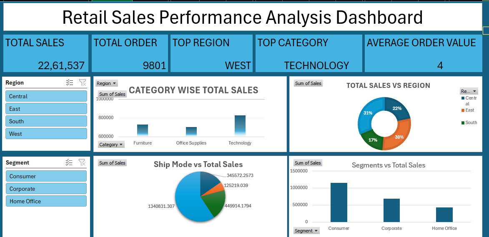

# Retail Sales Performance Analysis

## Overview
Analyzed 9,994 retail order line items (5,009 unique orders) to evaluate sales 
performance across regions, product categories, and customer segments.

## Tools Used
Microsoft Excel (Formulas, PivotTables, Charts)

## Key Findings
- Total Sales: $2,297,201 across 5,009 unique orders
- Top-performing region: West (32% of total sales)
- Top-performing category: Technology
- Average order value: $458.61
- Standard Class was the most used shipping mode (59% of sales)
- Consumer segment generated the highest sales, followed by Corporate and Home Office

## Dashboard Preview

## Files
- `Retail_Sales_Performance_Dashboard.xlsx` - Interactive Excel dashboard with formulas and charts
- `retail_sales.png` - Dashboard screenshot
